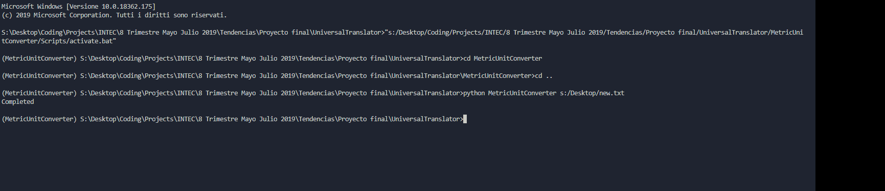

# UniversalTranslator

A little console app that allows to convert from a measure unit from another in the metric system

## How to use it!

### Input

The input file must be in the following format:

- value,input_unit,output_unit,

Example:

- 125,cm,m,

### Output

The program will create a new file named 'output.txt' which will have the following format:

- value,input_unit,output_unit,output_value

Example:

- 125,cm,m,1.25

Be sure to move or copy to another folder previosuly created 'output.txt' file or they will be overwritten

### Linux/MacOS

- Create a new folder
- Right click in your folder
- Open terminal
- Run 'git clone https://github.com/xeno097/UniversalTranslator.git' command
- Once the repository is cloned 'run cd UniversalTranslator/' command
- Finally run 'python3 MetricUnitConverter <your/file/directory/yourfile.txt>' command
- Wait for the program to display the 'Completed' message in Terminal

- Final result 

### Windows

#### Part 1

If you have git already installed on your pc ignore these steps

- Download git from this link: https://git-scm.com/download/win

- Install git on your pc running the installer

#### Part 2

If you have python 3.7.3 already installed on your pc please ignore these steps

- Download python 3.7.3 from this link: https://www.python.org/downloads/release/python-373/

- Run the python 3.7.3 installer and be sure to add python 3.7.3 to PATH

#### Part 3

- Create a new folder on your pc
- Open CMD
- Change directory in your folder
- Run 'git clone https://github.com/xeno097/UniversalTranslator.git' command
- Once the repository is cloned 'run cd UniversalTranslator/' command
- Finally run 'python3 MetricUnitConverter <your/file/directory/yourfile.txt>' command
- Wait for the program to display the 'Completed' message in CMD

- Final result 
